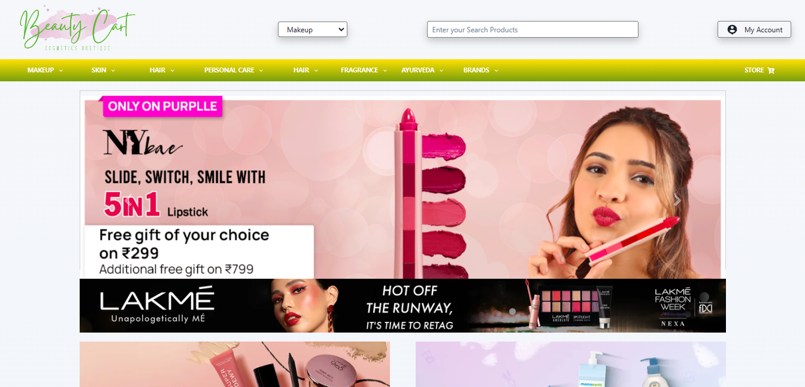
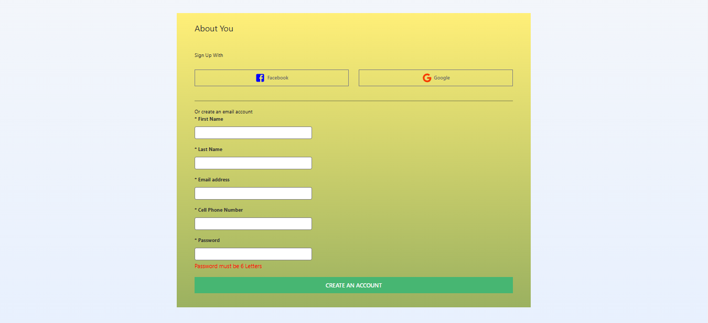
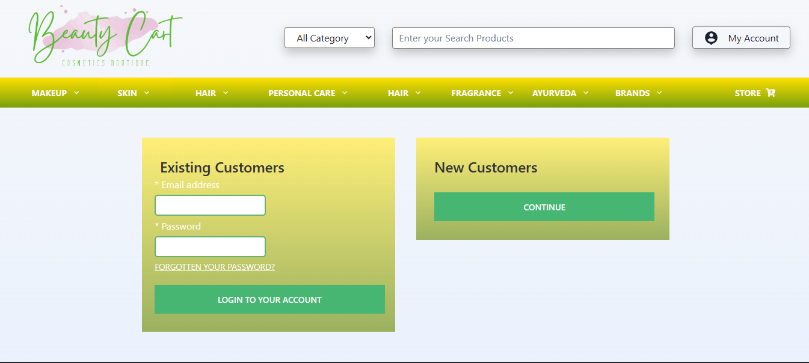
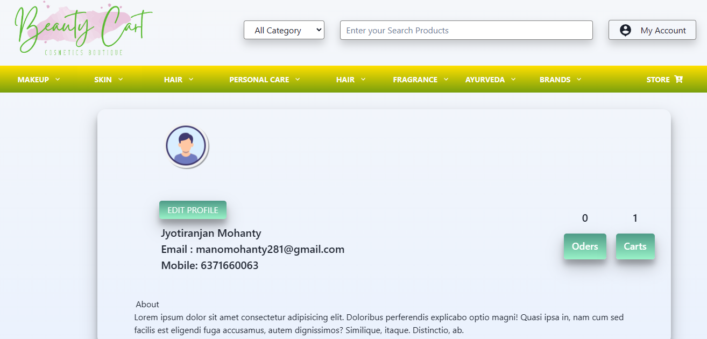
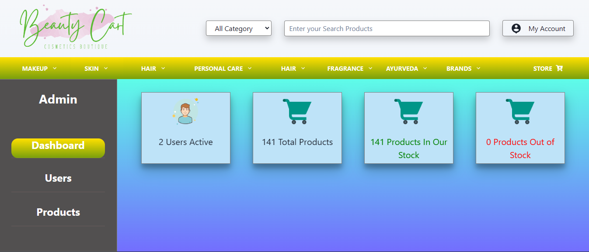
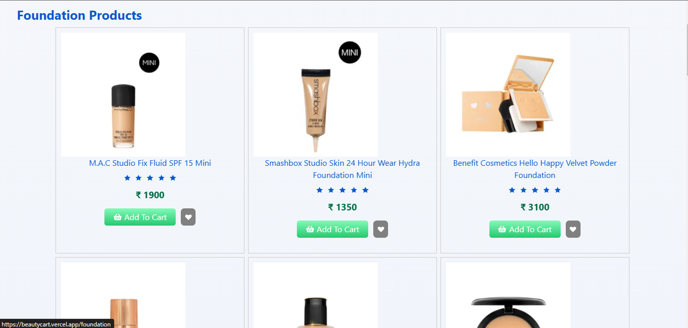
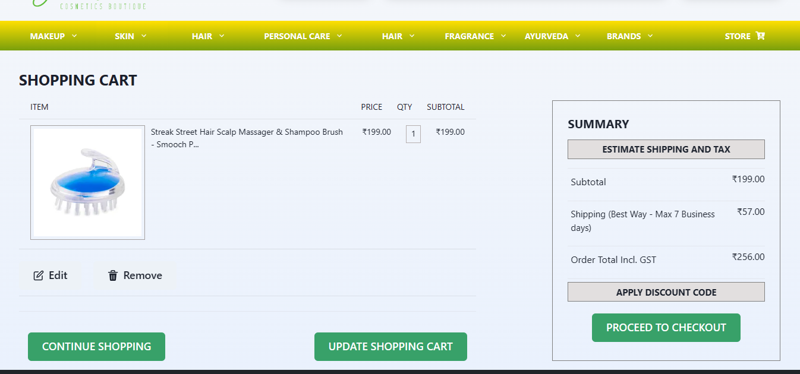
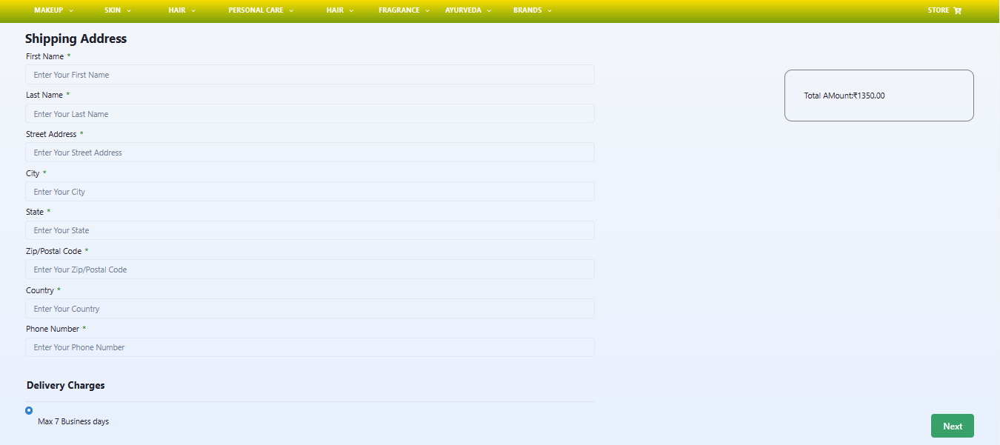
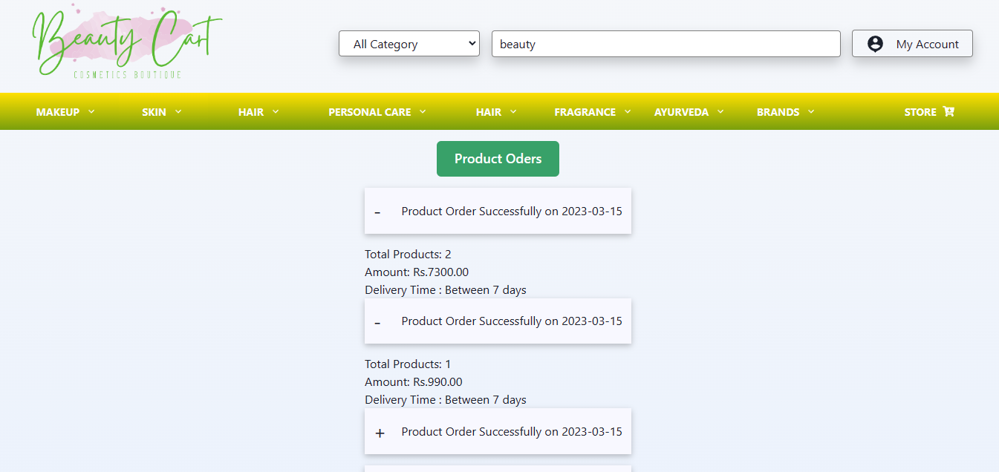
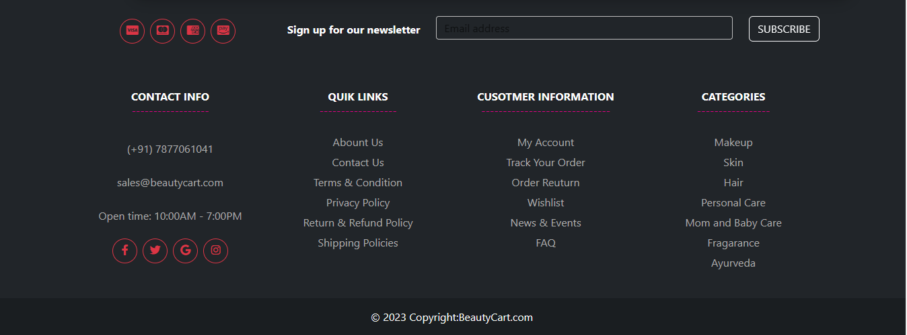

# BEAUTY CART (ECOMMERCE WEBSITE)

## About

### Beauty Cart is an Ecommerce website that deals with special occasion needs of Makeup, Skincare, Hair care, Personal care, Face wash, Wallet, and Ayurveda products. It is an individual project built in 6 days.

## Individual Project

- [JYOTIRANJAN MOHANTY](https://github.com/jyotiranjan1997)(Project Woner)

## Features

- Signup
- Login ( user login and admin login )
- Navbar
- Search functionality
- Footer
- Home Page
- Product Page
- Add to Cart
- Remove from Cart
- Profile Page (With all curd operation)
- My order page (Showing all oders details)
- Update product in Cart
- Cart Page
- Checkout or Payment Page
- Admin Dashboard

## Tech-Stack and library

# Frontend

- HTML
- CSS
- JavaScript
- ReactJS (Frontend framework for building single page application)

# Backend

- MongoDB
- ExpressJS
- NodeJS

# Other Libraries

- Chakra-UI
- Material-UI
- Bootstrap
- framer-motion
- react-router-dom (For Routing pages)
- React Redux (Helps to manage state globally)
- Sweet alert package (show alert UI)
- Aos (For animation)

## Overview

- ### Navbar
  
- ### Home Page
  
  - ### Signup or Register
    
- ### Login
  
- ### Profile Dashboard
  
  - ### Admin Dashboard
    
- ### Product Page
  
- ### Cart Page
  
- ### Checkout Page
  
  - ### Oder Page
    
- ### Footer
  
